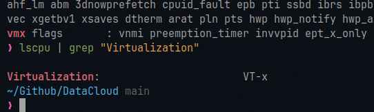

# Lab 1

## 1. Check if your processor supports Intel/AMD virtualization technology. Enable Intel virtualization technology in BIOS if possible

## 2. The cloud is almost everywhere in our lives now. What do you think are the fundamental reasons behind its success? Name three pros and three cons of cloud

### Fundamental reasons behind the cloud's success

- Scalability: On-demand resource allocation without upfront infrastructure costs.
- Cost-efficiency: Pay-as-you-go models reduce capital expenditure.
- Global accessibility: Enables remote work and data access from anywhere.

### Pros of cloud

1. Reduced IT costs and operational expenses.
2. High scalability and flexibility.
3. Disaster recovery and data backup solutions.

### Cons of cloud

1. Security and privacy risks.
2. Dependency on internet connectivity.
3. Potential vendor lock-in.

## 3. What is the primary function of a hypervisor in virtualization?

Manages and allocates physical resources (CPU, memory, storage) to virtual machines (VMs), enabling multiple OSes to run on a single physical host.

## 4. What is a virtual machine (VM)?

A software-based emulation of a physical computer that runs an operating system and applications, isolated by a hypervisor.

## 5. What are the benefits of using virtual machines?

1. Run multiple OSes on one physical machine.
2. Isolation enhances security and testing.
3. Efficient resource utilization.
4. Simplified disaster recovery and backups.
5. Cost savings on hardware.

## 6. List five use cases of virtual machines

1. Server consolidation.
2. Software development/testing environments.
3. Running legacy applications.
4. Cloud computing infrastructure.
5. Sandboxing for security analysis

## 7. In virtualization, what is the guest operating system?

a) The main operating system running on the physical machine  
**b) The operating system installed on a virtual machine** 
c) The operating system running on a remote server  
d) The operating system running on a mobile device  

## 8. What does virtual machine isolation mean?

### a) Virtual machines can communicate directly with the physical hardware

### b) Virtual machines share the same resources and cannot be isolated

### c) Virtual machines run independently and are isolated from each other and the host system

### d) Virtual machines can only be accessed locally

## 9. What is the benefit of virtual machine portability?

### a) It allows virtual machines to communicate with each other easily

### b) It ensures faster boot times for virtual machines

### c) It allows virtual machines to be moved between different physical machines with compatible hypervisors

### d) It reduces the need for hardware virtualization

## 10. What is the purpose of cloning a virtual machine?
