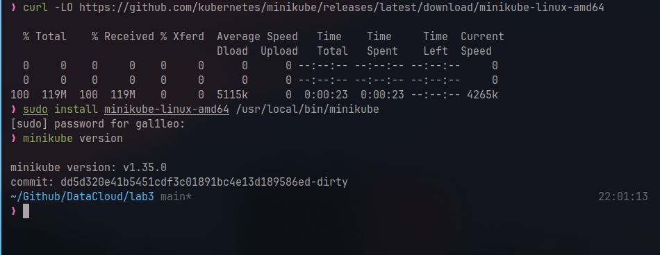
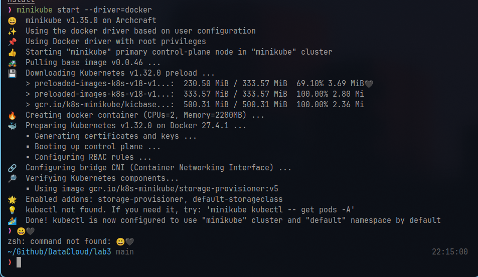
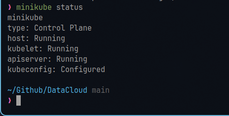
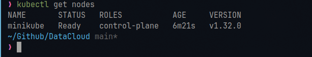
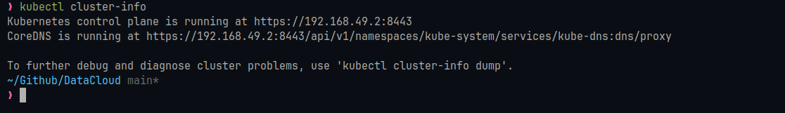
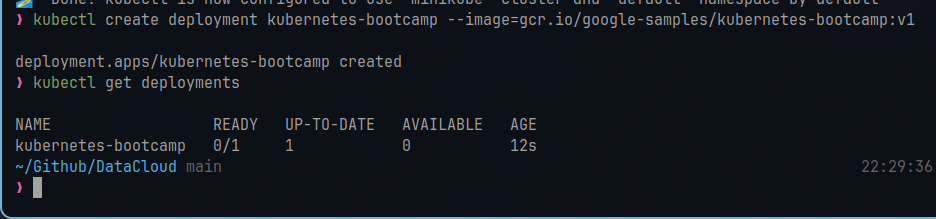
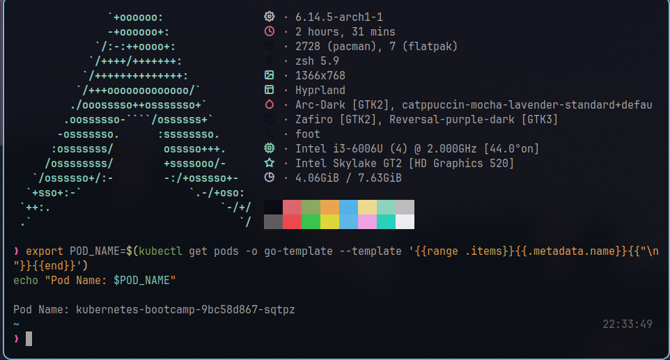
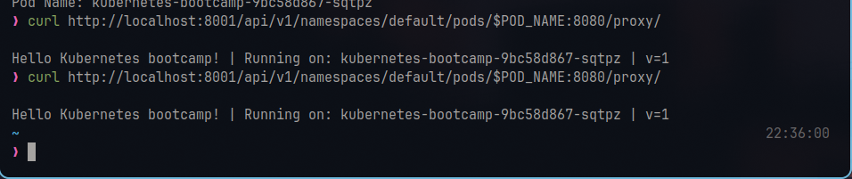

# Lab 3: Using Minikube to Create a Cluster

**Objective:** Start a local Kubernetes cluster using Minikube and understand its components.

------- 

## **1. Introduction to Kubernetes Clusters**

### Key Concepts:

- **Control Plane**: Manages the cluster (scheduling, scaling, updates).
- **Nodes:** Worker machines that run applications (VMs or physical machines).
- **Minikube:** A tool to create a single-node Kubernetes cluster for local development.

Cluster Diagram:


---

## **2. Setting Up Minikube**

### Steps:

1. **Prerequisites:**

- Enable virtualization (VT-x/AMD-V) in BIOS.
- Install a hypervisor (e.g., Docker Desktop, VirtualBox, or HyperKit).

2. **Install Minikube:**
```bash
curl -LO https://github.com/kubernetes/minikube/releases/latest/download/minikube-linux-amd64
sudo install minikube-linux-amd64 /usr/local/bin/minikube && rm minikube-linux-amd64
```

**Verification:**
```bash
minikube version
```

Screenshot of successful installation:



---

## 3. Start the Cluster

```bash
minikube start --driver=<driver-name>  # e.g., docker, virtualbox, hyperkit
```

- Example:
```bash
minikube start --driver=docker
```

****Output:****



---

## 4. Verify the Cluster

**Check Cluster Status:**

```bash
minikube status
```

**Output:**



**Check Nodes:**
```bash
kubectl get nodes
``` 

**Output:**



---

## 5. Cluster Components

**Control Plane and Node:**

- Minikube runs a single-node cluster where the control plane and worker node are combined.
- Use kubectl to interact with the cluster.
```bash
kubectl cluster-info
```

**Output:**



---

## 6. Stop and Delete the Cluster

**Stop the Cluster:**
```bash
minikube stop
```

**Delete the Cluster:**
```bash
minikube delete
```

## 7. Create Deploymet 

```bash
kubectl create deployment kubernetes-bootcamp --image=gcr.io/google-samples/kubernetes-bootcamp:v1
```



## 8. Access the Application

**Start the Proxy**
```bash
kubectl proxy
``` 

Explanation:  

- This command starts a proxy server that allows you to access the Kubernetes API and services running in your cluster.

! [Proxy Output](./assets/Screenshots/proxy)

**Get the Pod Name**
```bash
export POD_NAME=$(kubectl get pods -o go-template --template '{{range .items}}{{.metadata.name}}{{"\n"}}{{end}}')
echo "Pod Name: $POD_NAME"
```

**Output:**



**Access the Application:**

Use `curl` to interact with the Pod:
```bash
curl http://localhost:8001/api/v1/namespaces/default/pods/$POD_NAME:8080/proxy/
```

**Output:**


